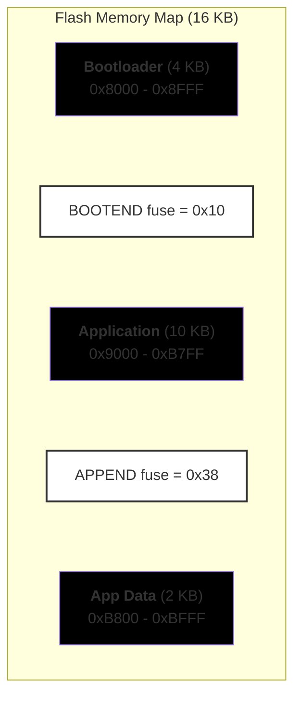

# System Memory Map

```mermaid


graph TD
    classDef memory fill:#000,stroke:#333 stroke-width:2px;
    classDef fuse fill:#fff,stroke:#333,stroke-width:2px;

    subgraph "Flash Memory Map (16 KB)"
        direction TB
        
        BL["<b>Bootloader</b> (4 KB)<br/>0x8000 - 0x8FFF"]:::memory

        BE["BOOTEND fuse" = 0x10]:::fuse
        
        APP["<b>Application</b> (10 KB)<br/>0x9000 - 0xB7FF"]:::memory
        
        AE["APPEND fuse = 0x38"]:::fuse
        
        DATA["<b>App Data</b> (2 KB)<br/>0xB800 - 0xBFFF"]:::memory

        BL ~~~ BE ~~~ APP ~~~ AE ~~~ DATA
    end
  
```